# ADS Final Project: Movie Poster Evaluator

Term: Fall 2016
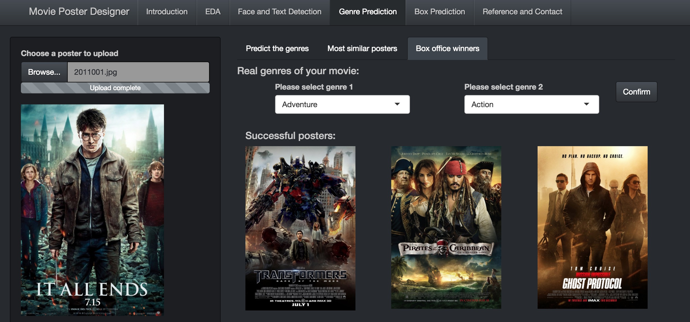
+ [Data link](http://www.imdb.com/search/title?year=2014,2014&title_type=feature&sort=boxoffice_gross_us,desc&page=4&ref_=adv_prv)
+ Data description: Our original data set includes original movie posters from imdb.com. Our processed data sets include deep features, detected face areas and face numbers, detected text areas, RGB features, etc.
+ [Shiny App](lib) 
	+ Since the app interacts with Python and Python packages, the app needs to be installed locally. Python, Caffe (extract deep features) and OpenCV (face/text detection) are required.
+ Team members
	+ team member 1 Yaqing Xie
	+ team member 2 Qing Yin
	+ team member 3 Tian Sheng
	+ team member 4 Sen Zhuang
	+ team member 5 Yueqi Zhang
+ Project title: Movie Poster Evaluator
+ Project theme: Movie Poster Analysis: Genre Prediction & Face Detection & Text Detection & Color Detection

## Project summary: 
+ 1.Poster Exploration
	+ Learn the movie/movie poster trend in the past five years!

+ 2.Face/Text Detection
	+ Is your poster well featured and easy-to-read?

+ 3.Movie Genre Predition
	+ How will a poster viewer perceive your poster?

+ 4.Box Office Predition
	+ Will your movie be a big success?

## Project Process
   Descriptions are in the project.rmd file in lib
# Prepare: Scrape the data from IMDB.com and preprocess the dataset
+ (1) Scraped the movie data set(Box>100 million) and movie posters from 2011 to 2016
+ (2) The data variables are: directors, stars, genres(1~3), gross, producer,etc.
+ (3) Counted the numbers of faces and other information on the posters.
+ (4) Used Opencv to extract the RGB features of each poster

# Part 1: Exploratory Data Analysis of Posters
+ (1) Objective: 
	+ The objective of this part is to learn the trend of posters from 2011 to 2015, and the relationship between face numbers, face area proportion on poster and genre
+ (2) Methodology
	+  The first step is to analyze the gross trend and frequency of diffrent genres from 2011 to 2015:
	We find that there was an increasing trend of fatacy movies and decreasing trend of Sci-fiction movies
	+  The second step is to analyze the relationship between face numbers, face area proportion on poster and genre:
	We find that the Family movies and Comedy movies tend to use bigger face and more stars on the poster, and the thriller tend to use no more than 1 face on the poster
	+  The third step is to analyze the RGB feature of each genre:
	We find that the thriller and Sci-fic movies tend to use dark and red colors, and the comedy and fantacy movies tend to use bright color like yellow and blue
+ (3) Interface: 
+ <1> Analyze the annual gross in different genres
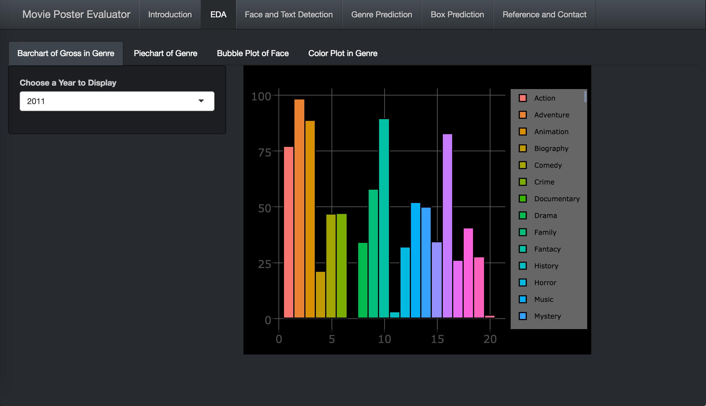
+ <2> Summarize the annual frequency of movies from different genres
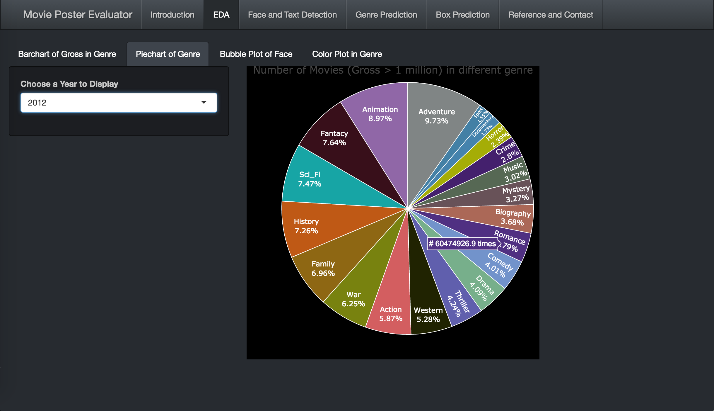
+ <3> Investigate the relationship between face numbers on a poster, face area proportion on a poster and genres
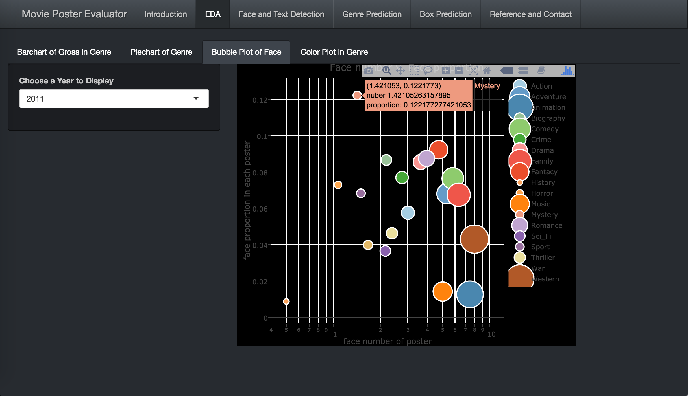
+ <4> Plot each genre's RGB distribution and find interesting results including:

+  Posters of Thrillers tends to use dark color like black and red 
+  Drama and Comedy tends to use bright color like yelow and green

# Part 2: Face Detection and Text Detection of Posters
+ (1) Objective: 
	+ The objective of this part is to detect face and text, and then compute the relevant information, such as face proportions, face numbers and text proportions.
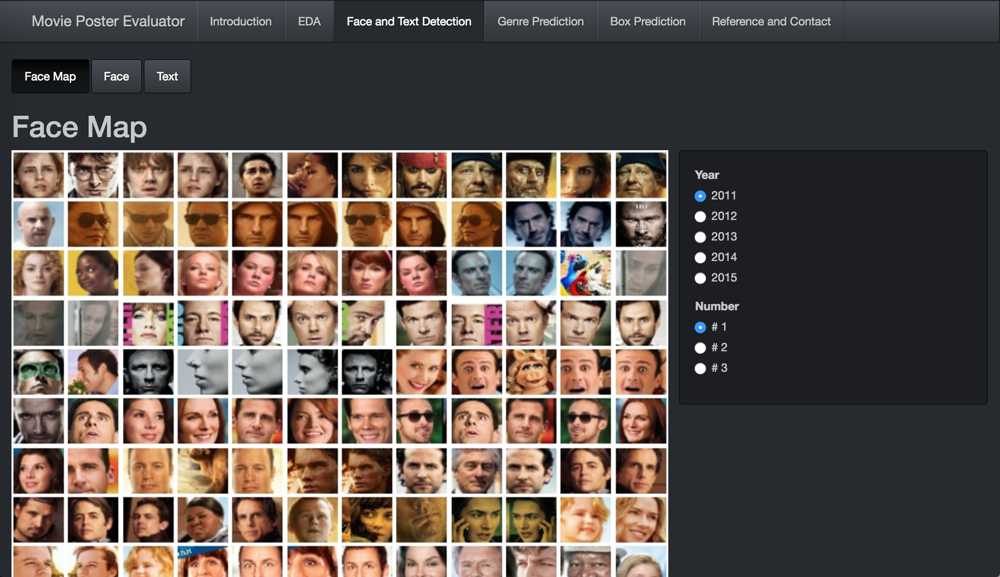
+ (2) Methodology: 
	+ The first step is to detect face by using Haar feature-based cascade classifiers in opencv and text by drawing contours on filtered and enhanced posters.
	+ Then, we can use extract areas to calculate the number of faces, the area proportion of faces, the number of characters and the area proportions of text in each poster.
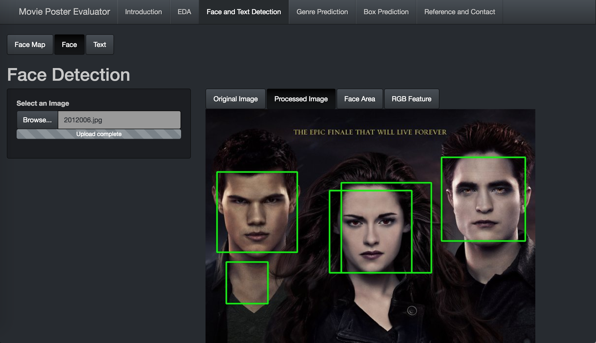
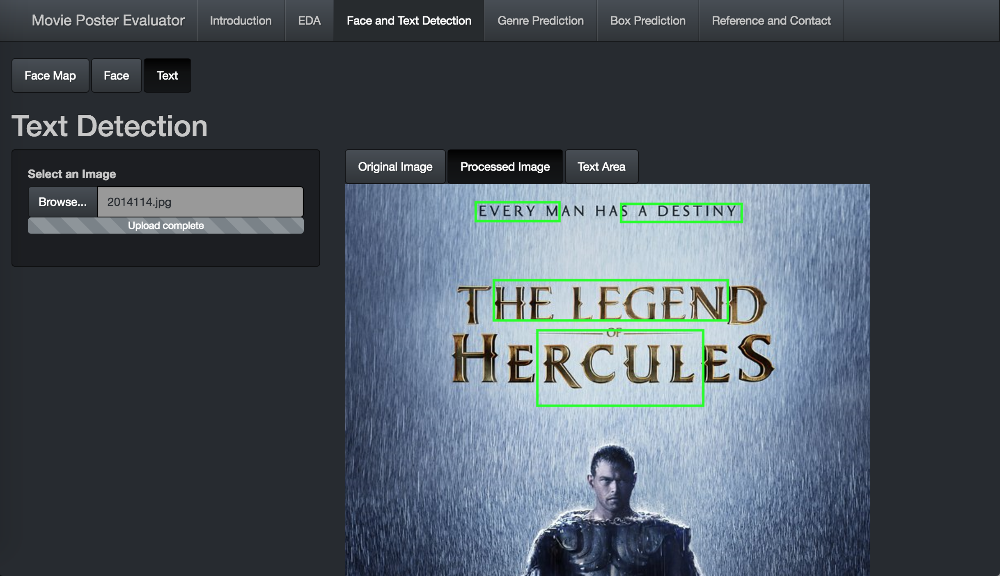
+ (3) Interface:
	+ In the "Face Map" tab, the user can explore all faces we extract from our original data sets.
	+ In the "Face" tab, the user is suggested to upload a poster and then the python can generate a poster with detected faces in the green box, and finally the user can get the computed information of the detected faces.
	+ In the "Text" tab, the user is suggested to upload a poster and then the python can generate a poster with detected text in the green box, and finally the user can get the computed information of the detected text.
+ (4) Note:
	+ All information in this part is served for the part 4: box prediction.

# Part 3: Genre Prediction
+ (1) Objective: 
	+ The objective of this part is to understand how a poster viewer will give the movie a genre based on the poster only. 
+ (2) Methodology:  
	+ The first step is to extract deep features of the posters we downloaded using Caffe 
	+ With the features and the genre data we scraped from IMDB.com, use _KNN Modeling_ to link the posters and genres and predict the genre of a new poster. By cross validation, the k should be 13 and the accuracy is 70%. 
	+ Save the two predicted genres of the poster and its thirteen neighbors. 
+ (3) Interface: 
	+ In the "Movie Genre Prediction" tab, the user needs to upload a poster and then click on "Start to Analyze". Once the analysis is done, the two predicted genres will be shown. 
	+ The user can also find similar posters in the database. Six most similar posters will be displayed to give a clue how the model predict the poster's genre. 
	+ If the predicted genres are incorrect, we help the movie producer to improve his poster design. We will show him 6 top box-office-winners once they input the real genres. 
+ (4) Illustration:
	+ In the following example, the model predicts the movie to be Horror and Drame. The similar posters explain why it regards it as a horror movie: 

	+ What if the producer want the audience to perceive it more like a Romance movie? He can choose Romance and Drama as the the real genres, and the interface will show him the six Romance Drama movies in the past five years who have the best box office. It can be seen from the screenshot that the producer should make the color of the poster lighter and probaby consider decreasing the face area proportion on the poster.
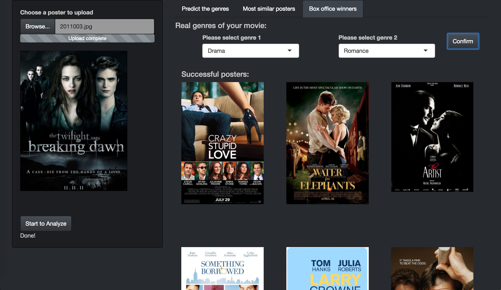

# Part 4: Box Prediction
+ (1) Objective:
	+ The objective of this part is to predict box office on the basis of a certain poster and give suggestions of improving attraction of it. 
+ (2) Methodology:
	+ Extract deep features to predict movie's genre, detect face/text and calculate face/text area proportion, get rgb information, and then use all these features to predict the Box of a new poster.
	+ Using the Random Forest model to predict the box level of the movie(Above 100M, Among 10M and 100M, Below 10M)
	+ By cross validation, the accuracy of this model is 60%.
	+ Giving face/text area proportion suggestion according to 6 posters with highest box office in the movie's genre predicted by deep feature in our database.
+ (3) Interface:
	+ Upload an upcoming poster first from local. Get the analysis result of this poster.
	+ Click "Showing predicting result" to see the box office level.
	+ Click "Recommendation" to see good examples and improving details we give
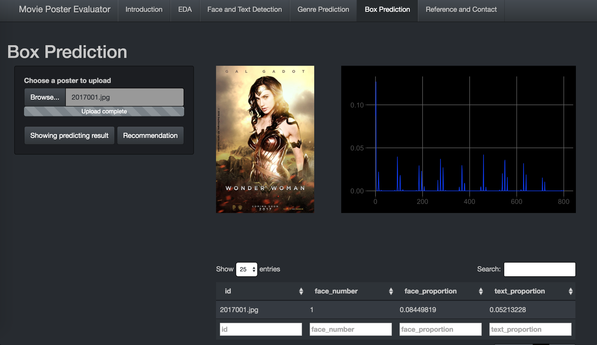
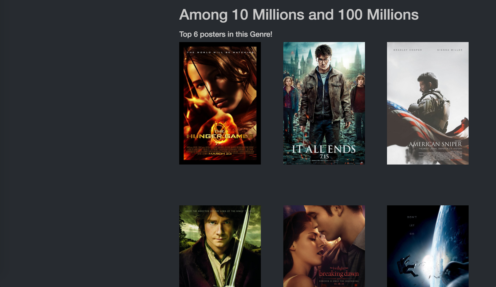
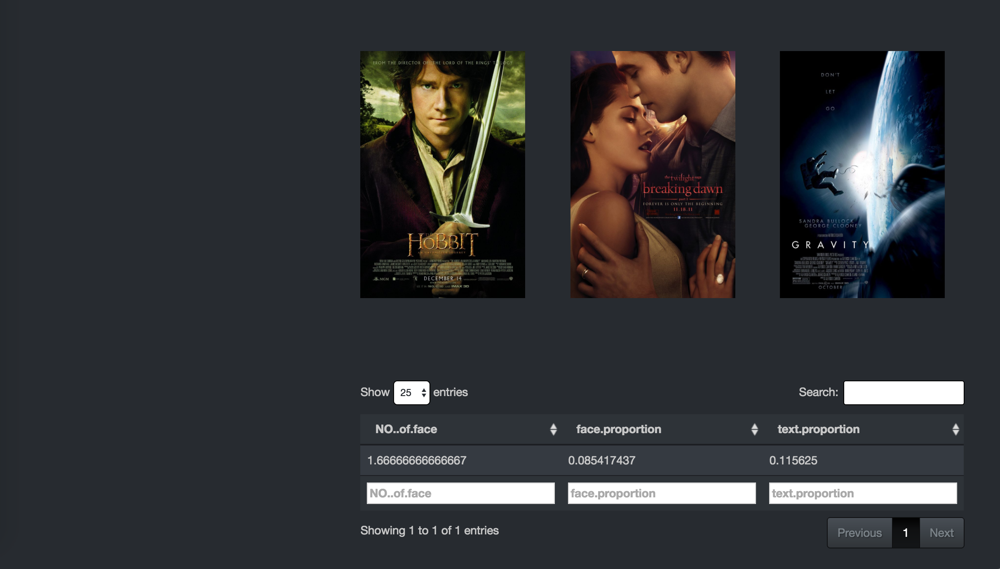

