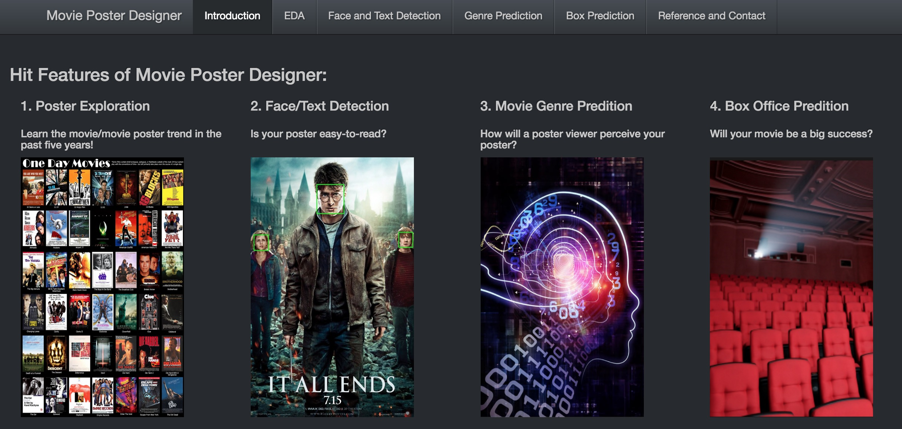
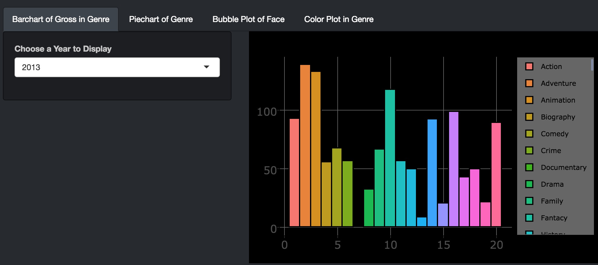

# ADS Final Project: 

Term: Fall 2016

# ADS Final Project: 

Term: Fall 2016

+ [Data link](http://www.imdb.com/search/title?year=2014,2014&title_type=feature&sort=boxoffice_gross_us,desc&page=4&ref_=adv_prv)
+ [Data description](doc/readme.html)
+ [Shiny App link](http://prezi.com/biyahojmsvrg/?utm_campaign=share&utm_medium=copy)
+ Team members
	+ team member 1 Yaqing Xie
	+ team member 2 Qin Ying
	+ team member 3 Tian Sheng
	+ team member 4 Sen Zhuang
	+ team member 5 Yueqi Zhang
+ Project title: Movie Poster Designer
+ Project theme: Movie Poster Analysis: Face Detection& Text Detextion & Color Detextion

## Project summary: 
+ 1.Poster Exploration
+ Learn the movie/movie poster trend in the past five years!

+ 2.Face/Text Detection
+ Is your poster easy-to-read?

+ 3.Movie Genre Predition
+ How will a poster viewer perceive your poster?

+ 4.Box Office Predition
+ Will your movie be a big success?

## Project Process
   Descriptions are in the project.rmd file in lib
# Prepare: Scrape the data from IMDB.com and preprocess the dataset
+ (1)Scraped the movie data set(Box>100 million) and movie posters from 2011 to 2016
+ (2)The data variables are: directors, stars, genres(1~3), gross, producer,etc.
+ (3)Counted the numbers of faces and other information on the posters.
+ (4)Used Opencv to extract the RGB features of each poster

# Part 1: Exploratory Data Analysis of Posters
+ (1)Analyze the annually gross in different genres
+ (2)Summarize the annually frequency of movies from different genres
+ (3)Investigate the relationship between face numbers on a poster,face area proportion on a poster and genres
+ (4)Plot each genre's RGB distribution and find interesting results including:
+  Posters of Thrillers tends to use dark color like black and red 
+  Drama and Comedy tends to use bright color like yelow and green

# Part 2: Face Detection and Text Detection of Posters
+ (1)Use python and Opencv to detect face and test in posters
+ (2)Calculate the number of faces, the area proportion of faces in each poster
+ (3)Calculate the number of characters detected and the area proportion of text in each poster

# Part 3: Genre Prediction
+  (1)Used Caffe to extract deep features of posters
+  (2)Used KNN Moldeling to link the posters and genres and predict the genre of a new poster
+  (3)if the predicted genres are incorrect, we will show the audience 6 correct posters once they choose their own genre

# Part 4: Box Prediction
+ (1)Use all the features to predict the Box of a new poster
+ (2)Using the Random Forest model to predict the box level of the movie

