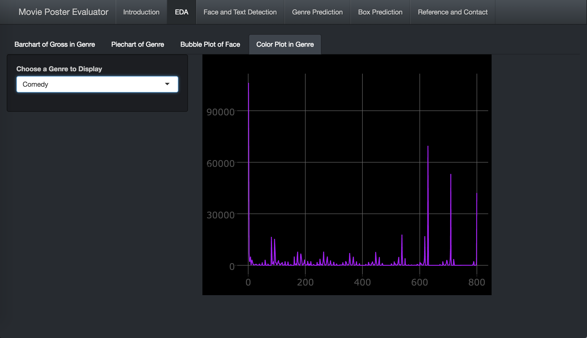
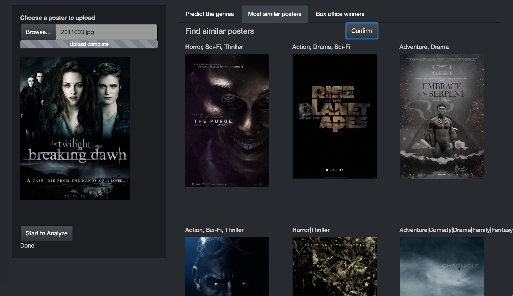

# ADS Final Project: Movie Poster Evaluator

Term: Fall 2016

+ [Data link](http://www.imdb.com/search/title?year=2014,2014&title_type=feature&sort=boxoffice_gross_us,desc&page=4&ref_=adv_prv)
+ [Data description](doc/readme.html)
+ [Shiny App link]
+ Team members
	+ team member 1 Yaqing Xie
	+ team member 2 Qing Yin
	+ team member 3 Tian Sheng
	+ team member 4 Sen Zhuang
	+ team member 5 Yueqi Zhang
+ Project title: Movie Poster Designer
+ Project theme: Movie Poster Analysis: Genre Predition & Face Detection & Text Detextion & Color Detextion

## Project summary: 
+ 1.Poster Exploration
+ Learn the movie/movie poster trend in the past five years!

+ 2.Face/Text Detection
+ Is your poster easy-to-read?

+ 3.Movie Genre Predition
+ How will a poster viewer perceive your poster?

+ 4.Box Office Predition
+ Will your movie be a big success?

## Project Process
   Descriptions are in the project.rmd file in lib
# Prepare: Scrape the data from IMDB.com and preprocess the dataset
+ (1)Scraped the movie data set(Box>100 million) and movie posters from 2011 to 2016
+ (2)The data variables are: directors, stars, genres(1~3), gross, producer,etc.
+ (3)Counted the numbers of faces and other information on the posters.
+ (4)Used Opencv to extract the RGB features of each poster

# Part 1: Exploratory Data Analysis of Posters
+ (1)Analyze the annual gross in different genres

+ (2)Summarize the annual frequency of movies from different genres

+ (3)Investigate the relationship between face numbers on a poster, face area proportion on a poster and genres

+ (4)Plot each genre's RGB distribution and find interesting results including:

+  Posters of Thrillers tends to use dark color like black and red 
+  Drama and Comedy tends to use bright color like yelow and green

# Part 2: Face Detection and Text Detection of Posters
+ (1)Use python and Opencv to detect face and test in posters

+ (2)Calculate the number of faces, the area proportion of faces in each poster

+ (3)Calculate the number of characters detected and the area proportion of text in each poster

# Part 3: Genre Prediction
+ (1) Objective: 
	+ The objective of this part is to understand how a poster viewer will give the movie a genre based on the poster only. 
+ (2) Methodology:  
	+ The first step is to extract deep features of the posters we downloaded using Caffe 
	+ With the features and the genre data we scraped from IMDB.com, use *KNN Modeling* to link the posters and genres and predict the genre of a new poster (according to cross validation, we choose k=13). 
	+ Save the two predicted genres of the poster and its thirteen neighbors. 
+ (3) Interface: 
	+ In the "Movie Genre Prediction" tab, the user needs to upload a poster and then click on "Start to Analyze". Once the analysis is done, the two predicted genres will be shown. 
	+ The user can also find similar posters in the database. Six most similar posters will be displayed to give a clue how the model predict the poster's genre. 
	+ If the predicted genres are incorrect, we help the movie producer to improve his poster design. We will show him 6 top box-office-winners once they input the real genres. 
+ (4) Illustration:

# Part 4: Box Prediction
+ (1)Extract deep features to predict movie's genre, detect face/text and calculate face/text area proportion, get rgb information, and then use all these features to predict the Box of a new poster
+ (2)Using the Random Forest model to predict the box level of the movie(Above 100M, Among 10M and 100M, Below 10M).
+ (3)By cross validation, the accuracy of this model is 59%.

